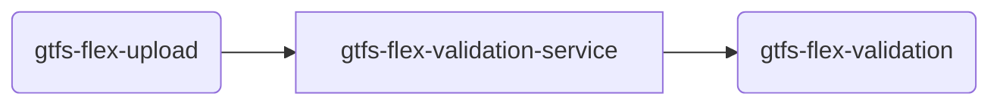

# TDEI-gtfs-flex-validation-python
## Introduction 
Service to Validate the GTFS flex file that is uploaded. At the moment, the service does the following:
- Listens to the topic _gtfs-flex-validation_ for any new message (that is triggered when a file is uploaded)
- Consumes the message and checks the filename in the message
  - if the filename contains the word _valid_ returns **valid** as the result
  - if the filename contains the word _invalid_ returns **invalid** as the result
  - if the file name does not contain either, it will return **invalid** as the result
- Publishes the result to the topic _gtfs-flex-validation_

## Getting Started
The project is built on Python with FastAPI framework. All the regular nuances for a Python project are valid for this.

### System requirements
| Software   | Version |
|------------|---------|
| Python     | 3.10.x  |


### Connectivity to cloud
- Connecting this to cloud will need the following in the `.env` file

```bash
UPLOAD_TOPIC=xxxx
UPLOAD_SUBSCRIPTION=xxxx
VALIDATION_TOPIC=xxxx
QUEUECONNECTION=xxxx
STORAGECONNECTION=xxxx
```
The application right now does not connect with the storage but validates via the file name.

### How to Setup and Build
Follow the steps to install the node packages required for both building and running the application

1. Setup virtual environment
    ```
    python3.10 -m venv .venv
    source .venv/bin/activate
    ```

2. Install the dependencies. Run the following command in terminal on the same directory as `requirements.txt`
    ```
    # Installing requirements
    pip install -r requirements.txt
    # Installing tdei-gtfs-csv-validator package
    pip install -i https://test.pypi.org/simple/tdei-gtfs-csv-validator
    ```
### How to Run the Server/APIs   

1. The http server by default starts with `8000` port
2. Run server
    ```
    uvicorn src.main:app --reload
    ```
3. By default `get` call on `localhost:8000/health` gives a sample response
4. Other routes include a `ping` with get and post. Make `get` or `post` request to `http://localhost:8000/health/ping`
5. Once the server starts, it will start to listening the subscriber(`UPLOAD_SUBSCRIPTION` should be in env file)

### How to Setup and run the Tests

#### How to add new tests
Add the new set of test inside `test/tests.json` file like -
```
{
 "Name": "Test Name",
 "Input_file": "test_files/flex_test_case1.json", // Input file path which you want to provide to the test
 "Result": true/false // Defining the test output 
 }
```
#### How to run the tests
1. Make sure you have setup the project properly, see above for `How to Setup and Build`.
2. Server should be running locally, see above for `How to Run the Server/APIs`. Once the setup is done, you can run the tests by hitting below command
```
    python tests/run_tests.py

```

### Messaging

This micro service deals with two topics/queues. 
- upload queue from gtfs-flex-upload
- validation queue from gtfs-flex-validation



#### Incoming
The incoming messages will be from the upload queue `gtfs-flex-upload`.
The format is mentioned in [msg-gtfs-flex-upload.json](./src/assets/msg-gtfs-flex-upload.json)

#### Outgoing
The outgoing messages will be to the `gtfs-flex-validation` topic.
The format of the message is at [gtfs-flex-validation.json](./src/assets/msg-gtfs-flex-validation.json)

