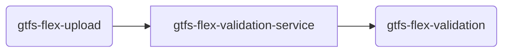

# TDEI-gtfs-flex-validation-python
## Introduction 
Service to Validate the GTFS flex file that is uploaded. At the moment, the service does the following:
- - Listens to the topic which is mentioned in `.env` file for any new message (that is triggered when a file is uploaded), example  `UPLOAD_TOPIC=gtfs-flex-upload`
- Consumes the message and perform following checks - 
  - Download the file locally 
  - File location is in the message `data.meta.file_upload_path`, reference see this file [msg-gtfs-flex-upload.json](./src/assets/msg-gtfs-flex-upload.json)
  - Uses `tdei-gtfs-csv-validator` to validate the file
  - Added the `isValid` and `validationMessage` keys to the original message
- Publishes the result to the topic mentioned in `.env` file, example `VALIDATION_TOPIC=gtfs-flex-validation`

## Getting Started
The project is built on Python with FastAPI framework. All the regular nuances for a Python project are valid for this.

### System requirements
| Software   | Version |
|------------|---------|
| Python     | 3.10.x  |


### Connectivity to cloud
- Connecting this to cloud will need the following in the `.env` file

```bash
REQUEST_TOPIC=xxxx
RESPONSE_TOPIC=xxxx
REQUEST_SUBSCRIPTION=xxxx
QUEUECONNECTION=xxxx
STORAGECONNECTION=xxxx
MAX_CONCURRENT_MESSAGES=xx
```
The application connect with the `STORAGECONNECTION` string provided in `.env` file and validates downloaded zipfile using `tdei-gtfs-csv-validator` package.
`QUEUECONNECTION` is not being used in this application but this is the main requirement for `python-ms-core` package

`MAX_CONCURRENT_MESSAGES` is the maximum number of concurrent messages that the service can handle. If not provided, defaults to 1

### How to Setup and Build
Follow the steps to install the node packages required for both building and running the application.

1. Setup virtual environment
    ```
    python3.10 -m venv .venv
    source .venv/bin/activate
    ```

2. Install the dependencies. Run the following command in terminal on the same directory as `requirements.txt`
    ```
    # Installing requirements
    pip install -r requirements.txt 
    ```

    NOTE: if you have problems building on a Mac, e.g. with uamqb, see here: https://github.com/Azure/azure-uamqp-python/issues/386

### How to Run the Server/APIs   

1. The http server by default starts with `8000` port
2. Run server
    ```
    uvicorn src.main:app --reload
    ```
3. By default `get` call on `localhost:8000/health` gives a sample response
4. Other routes include a `ping` with get and post. Make `get` or `post` request to `http://localhost:8000/health/ping`
5. Once the server starts, it will start to listening the subscriber(`UPLOAD_SUBSCRIPTION` should be in env file)

### How to Setup and run the Tests

Make sure you have setup the project properly before running the tests, see above for `How to Setup and Build`.

#### How to run test harness
1. Add the new set of test inside `tests/test_harness/tests.json` file like -
    ```
    {
     "Name": "Test Name",
     "Input_file": "test_files/flex_test_case1.json", // Input file path which you want to provide to the test
     "Result": true/false // Defining the test output 
     }
    ```
2. Test Harness would require the valid `.env` file.
3. To run the test harness `python tests/test_harness/run_tests.py` 
#### How to run unit test cases
1. `.env` file is not required for Unit test cases.
2. To run the unit test cases
   1. `python test_report.py`
   2. Above command will run all test cases and generate the html report, in `reports` folder at the root level.
3. To run the coverage
   1. `coverage run --source=src -m unittest discover -s tests/unit_tests`
   2. Above command will run all the unit test cases.
   3. To generate the coverage report in console
      1. `coverage report`
      2. Above command will generate the code coverage report in terminal. 
   4. To generate the coverage report in html.
      1. `coverage html`
      2. Above command will generate the html report, and generated html would be in `htmlcov` directory at the root level.
   5. _NOTE :_ To run the `html` or `report` coverage, 3.i) command is mandatory

#### How to run integration test cases
1. `.env` file is required for Unit test cases.
2. To run the integration test cases, run the below command
   1. `python test_integration.py`
   2. Above command will run all integration test cases and generate the html report, in `reports` folder at the root level.


### Messaging

This micro service deals with two topics/queues. 
- upload queue from gtfs-flex-upload
- validation queue from gtfs-flex-validation



#### Incoming Message
```json
{
    "messageId": "c8c76e89f30944d2b2abd2491bd95337",
    "messageType": "workflow_identifier",
    "data": {
      "file_upload_path": "https://tdeisamplestorage.blob.core.windows.net/gtfsflex/tests/success_1_all_attrs.zip",
      "user_id": "c59d29b6-a063-4249-943f-d320d15ac9ab",
      "tdei_project_group_id": "0b41ebc5-350c-42d3-90af-3af4ad3628fb"
    }
  }
```

#### Outgoing Message
```json
{
    "messageId": "c8c76e89f30944d2b2abd2491bd95337",
    "messageType": "workflow_identifier",
    "data": {
      "file_upload_path": "https://tdeisamplestorage.blob.core.windows.net/osw/test_upload/valid.zip",
      "user_id": "c59d29b6-a063-4249-943f-d320d15ac9ab",
      "tdei_project_group_id": "0b41ebc5-350c-42d3-90af-3af4ad3628fb",
      "success": true,
      "message": ""
    }
  }

```

